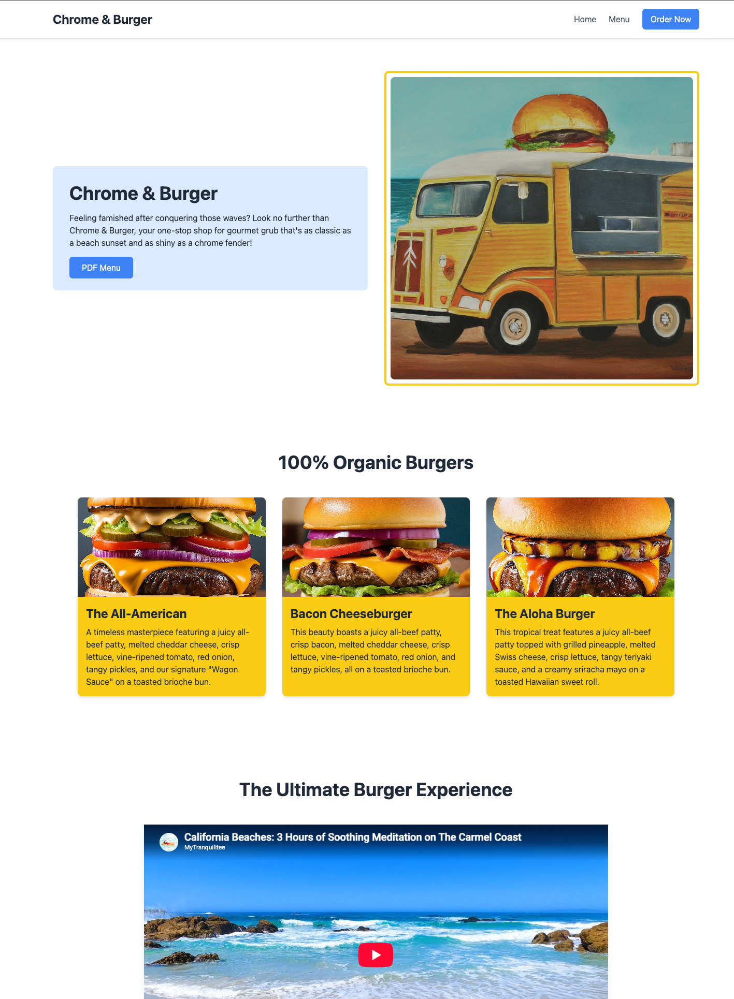
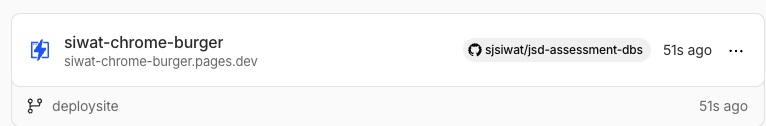
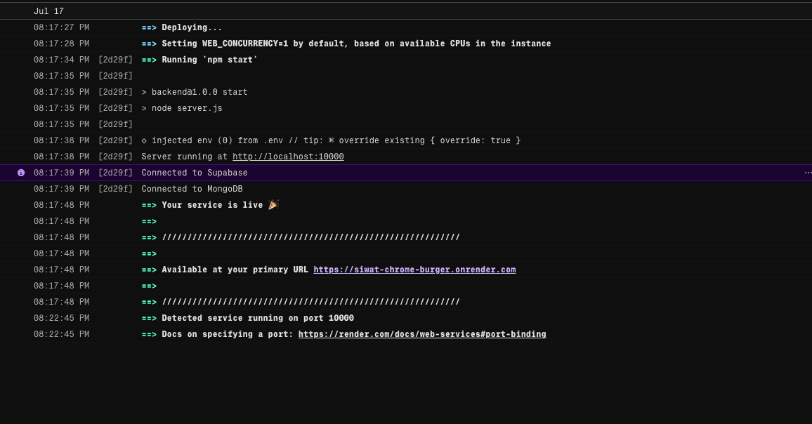

# JSD13 - Week 03: Database Assessment

> **Chrome & Burger** - A burger restaurant landing page with full-stack database integration.

## Live Demo

**Frontend:** https://siwat-chrome-burger.pages.dev/
**Backend API:** https://siwat-chrome-burger.onrender.com/api/menu-items

---

## Project Overview

This project covers database design, querying, and full-stack integration for a fictional burger restaurant called **Chrome & Burger**. It includes:

- Database schema design (PostgreSQL & MongoDB)
- SQL & NoSQL querying assessments
- A landing page frontend
- A REST API backend connecting to both databases

---

## Project Structure

```
jsd-assessment-dbs/
├── 01_initialize_databases/
│   ├── mock-db-sql/          # PostgreSQL schema & seed data
│   │   ├── create_tables.sql
│   │   ├── 01_suppliers.sql
│   │   ├── 02_staff.sql
│   │   ├── 03_ingredients.sql
│   │   ├── 04_menu_items.sql
│   │   ├── 05_recipe_items.sql
│   │   ├── 06_orders.sql
│   │   └── 07_order_items.sql
│   └── mock-db_nosql/        # MongoDB seed scripts
│       ├── 01_ingredients.mongodb.js
│       ├── 02_menu_items.mongodb.js
│       ├── 03_orders.mongodb.js
│       ├── 04_staff.mongodb.js
│       └── 05_suppliers.mongodb.js
├── 02_querying_assessment/
│   ├── postgresql/            # PostgreSQL queries + bonus (MongoDB)
│   │   ├── query_task1.sql
│   │   ├── query_task2.sql
│   │   ├── query_task3.sql
│   │   ├── query_task4.sql
│   │   └── bonus/
│   └── mongodb/               # MongoDB queries + bonus (PostgreSQL)
│       ├── query_task1.mongodb.js
│       ├── query_task2.mongodb.js
│       ├── query_task3.mongodb.js
│       ├── query_task4.mongodb.js
│       └── bonus/
├── 03_chrome-burger-landing-page/
│   ├── index.html             # Landing page (Home)
│   ├── menu.html              # Dynamic menu page (fetches from API)
│   └── assets/
│       ├── jpeg/              # Burger images
│       ├── pdf/               # PDF menu
│       └── svg/               # Icons
├── 04_example_api-server/
│   ├── server.js              # Express.js API server
│   ├── package.json
│   └── .env.example
└── pic/                       # Deployment & screenshot images
    ├── cloudflare_deploy.png
    ├── page.png
    └── render_backend.png
```

---

## Database Schema

The project uses **7 tables** in PostgreSQL (with equivalent MongoDB collections):

| Table | Description |
|---|---|
| **Suppliers** | Ingredient suppliers |
| **Staff** | Restaurant employees |
| **Ingredients** | Stock and supplier tracking |
| **MenuItems** | Burger menu with name, description, price, category |
| **RecipeItems** | Join table linking menu items to ingredients |
| **Orders** | Customer orders with total price and staff reference |
| **OrderItems** | Join table linking orders to menu items with quantity |

---

## Tech Stack

### Frontend
- HTML5
- Tailwind CSS (CDN)

### Backend
- Node.js + Express.js
- PostgreSQL (via Supabase)
- MongoDB (via Mongoose)

### Deployment
- **Frontend** - Cloudflare Pages
- **Backend** - Render

---

## Screenshots

### Landing Page


### Cloudflare Deployment


### Backend on Render


---

## API Endpoints

| Method | Endpoint | Description |
|---|---|---|
| GET | `/api/menu-items` | Get all menu items from Supabase (PostgreSQL) |
| GET | `/api/mongodb-menu-items` | Get all menu items from MongoDB |

---

## Running Locally

### Backend

```bash
cd 04_example_api-server
cp .env.example .env      # Fill in your SUPABASE_URI and MONGO_URI
npm install
npm run dev
```

The server will start at `http://localhost:3000`.

### Frontend

Open `03_chrome-burger-landing-page/index.html` in your browser, or use a local server:

```bash
cd 03_chrome-burger-landing-page
npx serve .
```
